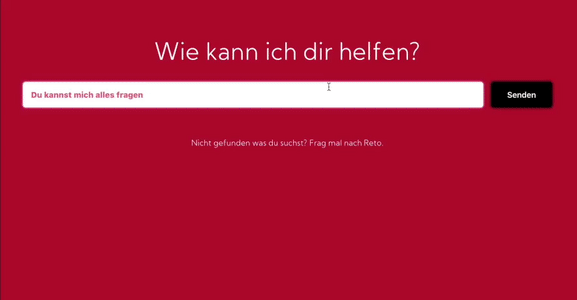
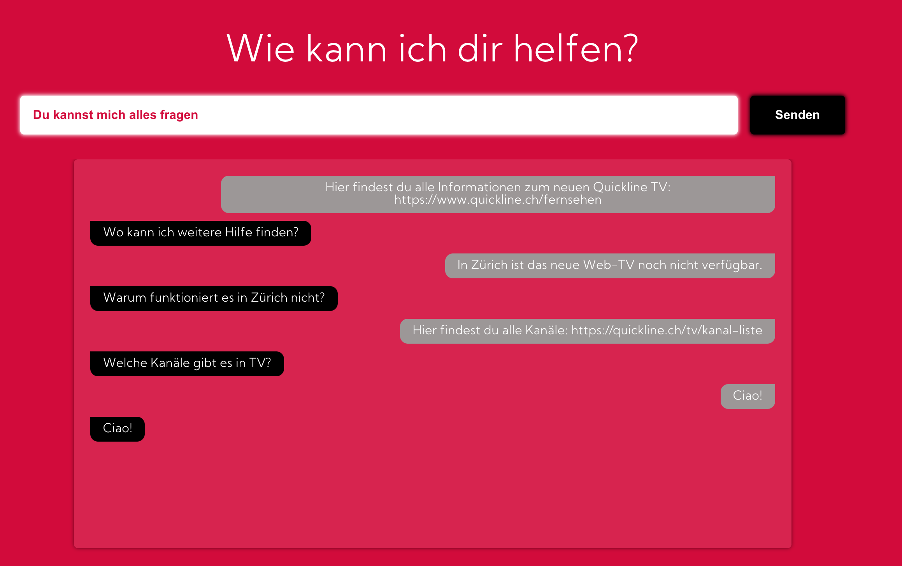

# Quick-Help-AI

> Framing large language models for interactive customer service

A word2vector similarity model is used to find related questions/answers/documents in a database. This context information is then used to frame the prompt fed to a larger general language model (such as GPT2/3 or BERT).

The swiss company QuickLine was used here as an example. A Q&A database for their services was created by scraping the company's web-presence. 

This model was built during the BärnHäckt Hackathon 2020.
